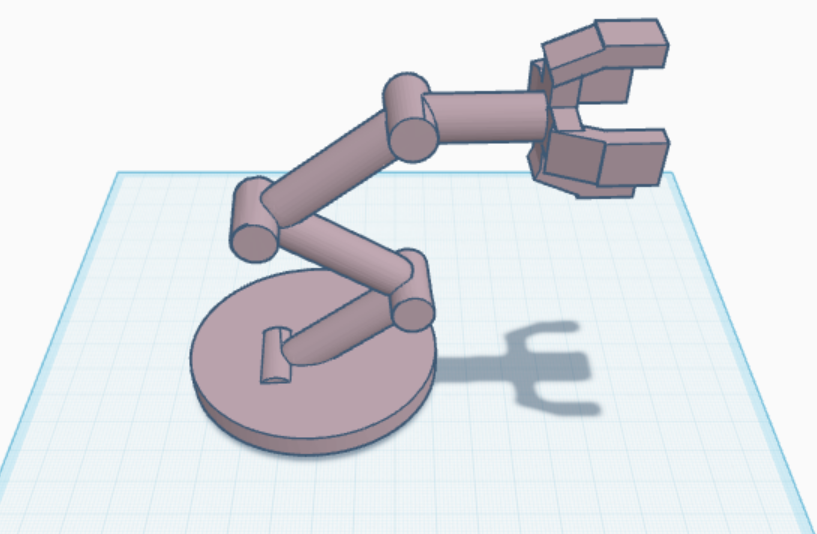

# 5-DOF-Robotic-Arm-Design
## Overview
This project presents a conceptual 3D model of a 5-degree-of-freedom (5-DOF) robotic arm created using Tinkercad. It is intended for educational use to demonstrate basic robotic arm kinematics and 3D modeling principles.

## Design Features
- **Degrees of Freedom**:
  - Base rotation
  - Shoulder joint
  - Elbow joint
  - Wrist pitch
  - Wrist rotation
- Gripper

## Screenshot

